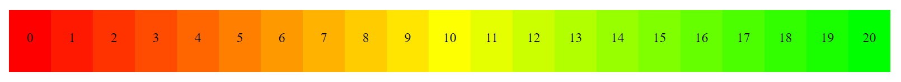

# Heatmap-Generator-with-Scale-SC
Melakukan generate "heatmap" dari merah ke hijau dengan skala yang dapat di atur

## How to Use
_Gunakan value **default** agar sesuai ekspetasi, memodifikasinya akan merubah tujuan dasar implementasi warna_.

min = minimal angka yang akan menjadi warna merah (value defaultnya 0).

max = maksimal angka yang akan menjadi warna hijau (value defaultnya 1).

Gunakan fungsi `numberToColorHsl(choose_scale/max_scale, min, max)` untuk output warna.

**catatan**: garis miring ('/') bukan atau, melainkan pembagi.

## Example
```php
<?php

require "heatmap.php";

// set scale by tuning below variable
$scale = 20;

$listcolor = '<ul>';
for ($i = 0; $i <= $scale; $i++) {
	$listcolor .= '<li style="background-color:' . numberToColorHsl($i / $scale, 0, 1) . '">' . $i . "</li>\n";
}
$listcolor .= '</ul>';

echo $listcolor;
?>
```

## Preview


## Source
Dimodifikasi dan mendapat ide dari: https://stackoverflow.com/questions/35848025/php-red-to-green-rgb-color-heatmap

## License
 [GNU General Public License v3.0](https://github.com/Evdigi-INA/Heatmap-Generator-with-Scale-SC/blob/main/LICENSE)
